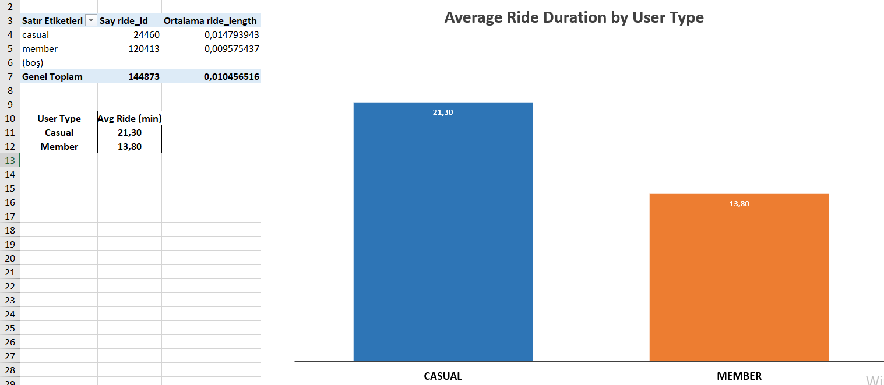

# Bike Share Data Analysis 🚴‍♂️

## 📊 Project Overview
This project analyzes bike-sharing data using Excel to understand user behavior patterns.

## 🔍 Key Insight
Casual users ride longer (~21 minutes) than members (~14 minutes).

## 🛠 Tools Used
- Excel
- Pivot Tables
- Data Visualization

## 📈 Visualization

## 📁 Files
- bike_analysis.xlsx → analysis file
- chart.png → visualization
